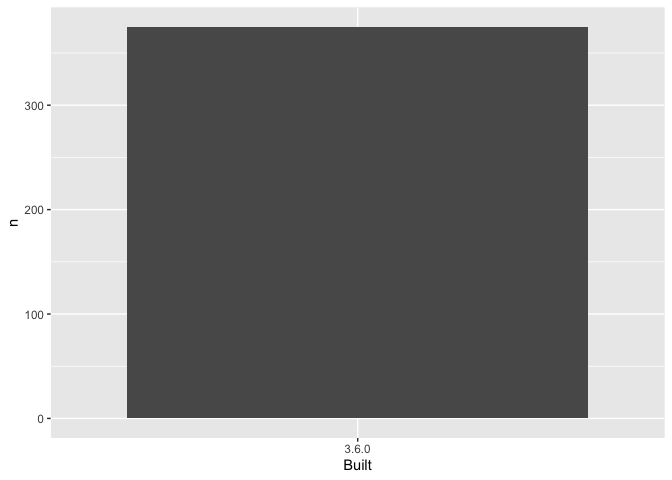

04\_barchart-packages-built.R
================
RASV5G
2020-01-27

``` r
## remember to restart R here!

## make a barchart from the frequency table in data/add-on-packages-freqtable.csv

## read that csv into a data frame
## hint: readr::read_csv() or read.csv()
## idea: try using here::here() to create the file path

suppressPackageStartupMessages(library(tidyverse))
apt_freqtable <- read_csv(here::here("data/add-on-packages-freqtable.csv"))
```

    ## Parsed with column specification:
    ## cols(
    ##   Built = col_character(),
    ##   n = col_double(),
    ##   prop = col_double()
    ## )

``` r
## if you use ggplot2, code like this will work:
ggplot(apt_freqtable, aes(x = Built, y = n)) +
  geom_col()
```

<!-- -->

``` r
## write this barchart to figs/built-barchart.png
## if you use ggplot2, ggsave() will help
## idea: try using here::here() to create the file path

ggsave(here::here('figs/built-barchart.png'))
```

    ## Saving 7 x 5 in image

``` r
## YES overwrite the file that is there now
## that's old output from me (Jenny)
```
